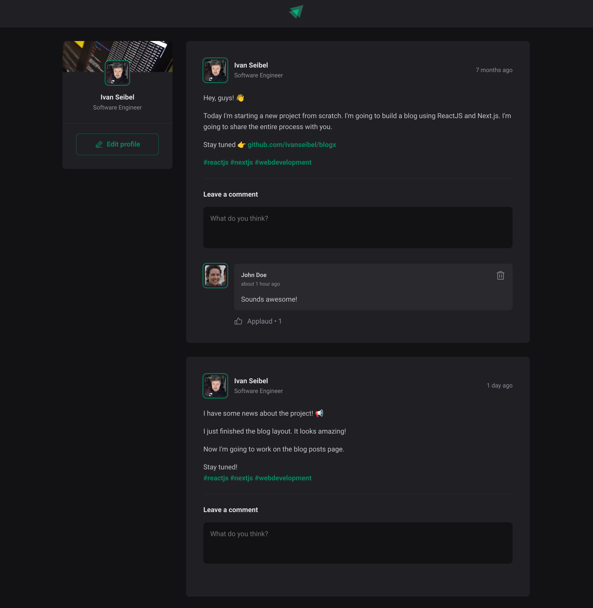

# Ignite Feed

<p align="center">
  
</p>

Ignite Feed is a study project developed as part of an MBA program, designed to reinforce modern web development concepts using React. This project demonstrates the creation of a simple social media feed, with a focus on applying best practices in programming, responsive design, and component-based architecture.

## Features

- Display user posts with avatars, timestamps, and comments.
- Responsive layout with a clean, modern design.
- Users can leave comments on posts.
- Components include header, sidebar, post, comment, and avatar, all styled using CSS modules.
- Utilizes modern JavaScript features, React hooks, and TypeScript for type safety.

## Tech Stack

- **React 18**: JavaScript library for building user interfaces.
- **TypeScript**: Typed superset of JavaScript to add type definitions.
- **Vite**: Fast development server and build tool.
- **Phosphor React**: Icon library for easily adding icons to the UI.
- **Date-fns**: Library for manipulating dates in JavaScript.
- **ESLint**: Tool for identifying and reporting on patterns in JavaScript.

## Getting Started

### Prerequisites

- Node.js (v16.x or higher)
- npm (v7.x or higher)

### Installation

1. Clone the repository:
   ```bash
   git clone https://github.com/yourusername/ignite-feed.git
   ```
2. Navigate to the project directory:
   ```bash
   cd ignite-feed
   ```
3. Install the dependencies:
   ```bash
   npm install
   ```

### Running the Project

To start the development server, run:

```bash
npm run dev
```

The application will be available at `http://localhost:3000`.

### Building for Production

To build the project for production, run:

```bash
npm run build
```

The built files will be available in the `dist` directory.

### Linting

To run ESLint and check for code quality issues, run:

```bash
npm run lint
```
